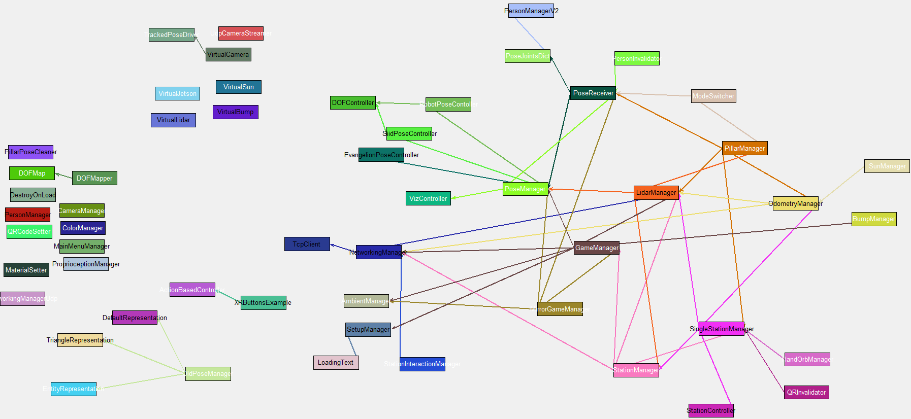

# PhysicalMetaverse

[]

Draft scheme of the core components for Sensory Translation. Generated using code_map.py developed for this repository.

Description of your project goes here. Provide a brief overview of what your project is about, its features, and any other relevant information.

## Table of Contents

- [Installation](#installation)
- [Usage](#usage)
- [Contributing](#contributing)
- [License](#license)

## Installation

Provide instructions on how to install your project. Include any dependencies and steps required to set up the project.

```bash
# Example installation commands
npm install

